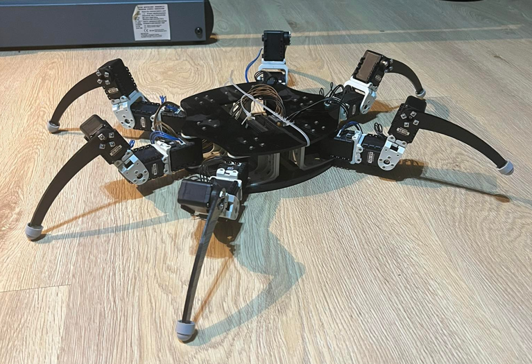

# Hello there 👋🏻

## General 

- 👋🏻 Hello I am revalew, AKA Maks Kisiel
- 👀 I’m interested in programming, robotics and ocasional web development (frontend, hardly in the back)
- 📚 I'm currently learning about Computer Vision and Machine Learning with Python as well as LaTeX and JavaScript
- 👨🏻‍💻🕺🏻 In the free time I like to learn new things, read a good book or go for a jog

## Current projects

### Hexapod & Computer Vision

&ensp;

<!-- 

 -->

&ensp;

## Technologies and skills:

<table align="center">
<thead><th>

#### Programming & Robotics

</th><th>&emsp;&emsp;&emsp;&emsp;</th><th>

#### WebDev

</th></thead>
<tbody>
<tr><td>

| **What I know** | **What's next** |
|:-:|:-:|
| C |LaTeX|
| C++ |Machine Learning|
| Python |Computer Vision|
|NumPy|Even more C / C++|
|MATLAB|Inverse kinematics|
|Simulink|ROS|
|Git|Linux|
|SQL|C# / Java|
|Raspbian|OpenCL, Cuda|
|LabVIEW||
  
<!-- | **What I know** |
|:-:|
| C |
| C++ |
| Python |
|MATLAB|
|Simulink|
|SQL|
|Git|
|Raspbian|
  
| **What's next** |
|:-:|
|LaTeX|
|Machine Learning|
|Computer Vision|
|Inverse kinematics|
|ROS|
|C# / Java|
|Even more C / C++|
|Linux| -->

</td><td></td><td>

| **What I know** | **What's next** |
|:-:|:-:|
| HTML |Advanced Node.js|
| CSS ||
|JavaScript||
|PHP||
|SQL||
|SASS, BEM||
|Bootstrap||
|Basic Node.js||
|Gulp, npm||
|RWD, SEO||

</td></tr>
</tbody>
</table>
