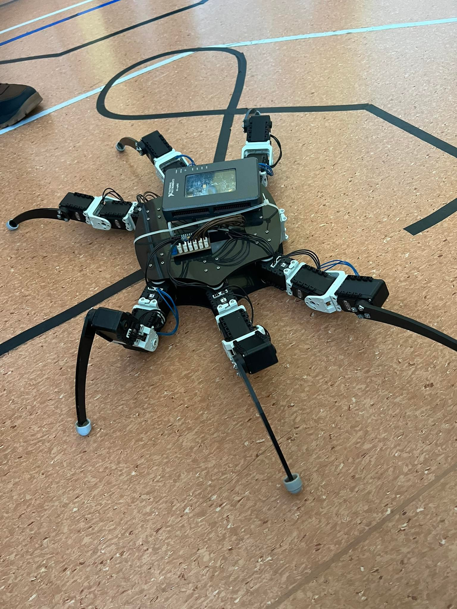

# Hello there 👋🏻

## General 

- 👋🏻 Hello I am revalew, AKA Maks Kisiel
- 👀 I’m interested in programming, robotics and ocasional web development (frontend, hardly in the back)
- 📚 I'm currently learning about Computer Vision and Machine Learning with Python as well as LaTeX and JavaScript
- 👨🏻‍💻🕺🏻 In the free time I like to learn new things, read a good book or go for a jog

## Current projects

### Hexapod & Computer Vision

## Programming & Robotics

#### Technologies and skills:

| **What I know** | **What's next** |
|:-:|:-:|
| C |LaTeX|
| C++ |Machine Learning|
| Python |Computer Vision|
|MATLAB|Inverse kinematics|
|Simulink|ROS|
|SQL|C# / Java|
|Git|Even more C / C++|
|Raspbian|Linux|

## WebDev

#### Technologies and skills:

| **What I know** | **What's next** |
|:-:|:-:|
| HTML |Advanced Node.js|
| CSS ||
|JavaScript||
|PHP||
|SQL||
|SASS, BEM||
|Bootstrap||
|Basic Node.js||
|Gulp||
|npm||
|RWD, SEO||

